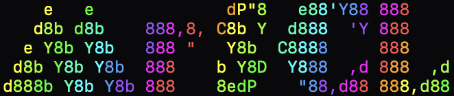

  

# WORK IN PROGRESS
This project is essentially an interpreter which adds the novelty of permitting the programming to define symbolic constraints to catch common linear algebra errors at compile-time. The programmer can inform the compiler about the dimensions of their vectors and matrices, and the compiler will in turn prevent bad behaviors from crashing a program hours into execution.

